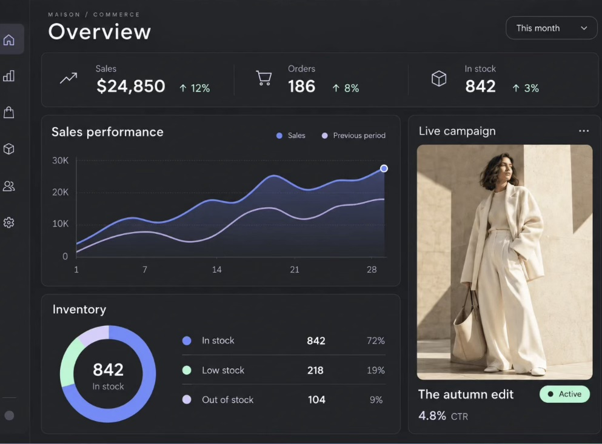

# KDNA eCommerce Insights: project brief

KDNA | Brief v1.1 (plugin 1.0.0) | 9 October 2026

## 1. At a glance

| Item | Value |
| --- | --- |
| Plugin name | KDNA eCommerce Insights |
| Slug and text domain | kdna-ecommerce-insights |
| PHP class prefix | KDNA_EcommerceInsights_ |
| Short prefix (options, tables, REST, CSS variables) | kdna_ei_ (PHP and database), --kdna-ei- (CSS), kdna-ei/v1 (REST) |
| JavaScript events | kdna:ei-range-change, kdna:ei-theme-change, kdna:ei-data-loaded |
| Final version | 1.0.0, packaged once at the end as kdna-ecommerce-insights-1.0.0.zip |
| Requires | WordPress 6.5+, PHP 8.1+, WooCommerce 9.0+ (HPOS compatible) |
| Elementor | Elementor 3.x and Elementor Pro for the widgets. The wp-admin dashboard works without Elementor. |
| Who can see data | Administrators only (capability manage_options), in wp-admin, in the widgets and in the REST API |
| Intended use | Reusable across any KDNA client WooCommerce store, with per-client branding |

## 2. Purpose

KDNA eCommerce Insights shows a WooCommerce store owner what they actually made, not just what they sold. WooCommerce reports revenue, but it does not subtract the cost of the product, the card fees, the real postage, the advertising or the monthly overheads. This plugin does, order by order, and turns the result into a beautifully designed dashboard that feels like a premium SaaS product rather than a WordPress settings screen.

It lives in two places. Inside wp-admin, it is a full, stylised dashboard app based on the reference design in section 4. On the front end, a set of Elementor widgets lets an administrator build their own private dashboard page with full design control. Both read from the same data, so the numbers always match.

Because it is built for reuse across KDNA clients, everything that is brand or business specific (colours, fonts, store name, tax rules, cost rules, ad accounts) is a setting, never hard-coded.

## 3. Decisions locked in scoping

| Topic | Decision |
| --- | --- |
| Where it lives | Both: stylised wp-admin dashboard app plus Elementor widgets for a login-protected front-end page |
| Stores | Reusable for any KDNA client store, one install per store |
| Costs deducted | Product cost (COGS), payment fees, actual shipping cost, ad spend, fixed overheads |
| Product cost entry | A cost field on every product and variation (plus bulk editor and CSV, see section 7) |
| Ad spend | Manual entry, CSV upload, and live Meta and Google Ads API connections |
| Extra modules | Inventory, Customers, Products, Tax and Reports |
| Order history | All past orders processed in the background on install |
| Access | Administrators only |
| Visual style | Dark theme by default like the reference, light mode toggle, accent colours brandable per client |
| Hero card (where the reference shows "Live campaign") | A setting with three options, only one shown at a time: Top Products, Profit Breakdown, Goals Tracker |
| wp-admin look | Fully stylised to match the reference, not standard WordPress admin screens |

## 4. Visual direction

This reference sets the look and feel for both the wp-admin app and the default styling of the Elementor widgets.



*Reference design supplied by Nick. The "Live campaign" card is replaced by the Hero card setting (Top Products, Profit Breakdown or Goals Tracker).*

### 4.1 What makes it work

- Near-black, slightly warm charcoal page with cards one step lighter, separated by hairline borders rather than heavy shadows.
- A small uppercase, widely letter-spaced eyebrow above a large, light-weight page title ("MAISON / COMMERCE" over "Overview"). In our build the eyebrow shows the store name and current section.
- A slim icon-only sidebar on the left with a soft rounded highlight for the active page.
- One KPI strip across the top: line icon, muted label, big number, small coloured change indicator. Thin vertical dividers between metrics.
- Smooth curved area chart with a soft gradient fill under the primary line, a lighter comparison line, a ringed dot on the latest point and quiet gridlines.
- A chunky donut with the headline number in the centre, paired with a clean legend table (dot, label, value, percentage) with hairline row dividers.
- Pill-shaped status badge in mint, pill-shaped period dropdown with a thin outline.
- Generous radius (around 14 to 16px), generous padding, very few colours: periwinkle, lavender and mint on charcoal.

### 4.2 Design tokens (defaults, all overridable in Settings > Branding)

Colours sampled from the reference. Every value is a CSS custom property so the Elementor widgets and the admin app share one system.

| Token | Dark (default) | Light | Used for |
| --- | --- | --- | --- |
| --kdna-ei-bg | #202125 | #F4F5F7 | Page background |
| --kdna-ei-surface | #26272B | #FFFFFF | Cards |
| --kdna-ei-surface-raised | #2E2F34 | #F0F1F4 | Hover, popovers, active sidebar item |
| --kdna-ei-border | rgba(255,255,255,0.07) | rgba(17,18,22,0.08) | Card borders, dividers, gridlines |
| --kdna-ei-text | #F3F3F5 | #15161A | Primary text and numbers |
| --kdna-ei-text-muted | #9C9DA4 | #6B6E78 | Labels, axes, secondary text |
| --kdna-ei-accent | #7188EE | #5A6FE0 | Primary series, donut, focus rings |
| --kdna-ei-accent-2 | #C9C2F8 | #9C92E8 | Comparison series, secondary segments |
| --kdna-ei-positive | #B6F2D0 | #1F9D62 | Up changes, healthy stock, Active badges |
| --kdna-ei-warning | #F5D58A | #B7791F | Low stock, missing costs |
| --kdna-ei-negative | #F2A7A7 | #D64545 | Down changes, losses, out of stock |
| --kdna-ei-radius | 16px | 16px | Cards |
| --kdna-ei-radius-pill | 999px | 999px | Badges, dropdowns, buttons |

> **Smart change colours.** A rising number is not always good. Costs, refunds, ad spend and out-of-stock counts going up must show in the negative colour. Each metric definition carries a "higher is better" flag that decides the colour.

### 4.3 Typography

- Default font: Figtree (Google Font, geometric and very close to the reference). Bundled locally in the plugin rather than loaded from Google, which is faster and avoids privacy issues.
- Branding setting lets each client choose from a short list of bundled fonts (Figtree, Inter, Montserrat, DM Sans, Manrope) or "inherit from site" for the Elementor widgets.
- Page title 44px light (300), card titles 20px regular, KPI numbers 30px semi-bold with tabular figures so digits line up, labels 14px muted, eyebrow 11px uppercase with 0.2em letter spacing.

### 4.4 Motion and interaction

- Numbers count up on first load (respecting the reduced motion preference).
- Charts draw in left to right, donut segments sweep in. 400 to 600ms, ease-out.
- Hover on chart shows a vertical guide line and a floating tooltip card with both periods and the change.
- Skeleton shimmer placeholders while data loads, never a spinner on a blank card.
- Light/dark toggle in the top bar, remembered per admin user.
- Optional Focus Mode button that collapses the WordPress admin menu and admin bar so the dashboard fills the screen.

## 5. Competitor research and what we take from it

| Tool | What it does well | Gap we fill |
| --- | --- | --- |
| Metorik (external SaaS) | The benchmark. Costs per product and variation with parent fallback, shipping cost rules by country, weight or method, ad spend integrations across many platforms, recurring and one-off overheads, costs locked in at the time of the order so history stays stable, recalculation tools, scheduled email digests. | Monthly subscription per store, data leaves the site, no Elementor widgets, no client branding. |
| Cost of Goods for WooCommerce (WPFactory) | Cost field placement options, bulk editing, CSV import, gateway fees as fixed plus percentage, shipping cost per method, several refund handling modes, profit columns in the orders list, a loss warning on orders. | Lives in standard WordPress screens, reporting is basic, no ad spend, no overheads, no designed dashboard. |
| WooCommerce native Cost of Goods Sold | WooCommerce now has its own cost field for products and variations (introduced as an experimental feature in 9.9). It stores cost per line item at order time and subtracts refunded costs. | Off by default, no profit reporting or analytics yet, no fees, shipping, ads or overheads. |

### 5.1 Best practices we are adopting

- Lock costs in at the time of the order. If a supplier price changes in March, January profit must not change. Each order line stores the cost that applied when it was paid.
- Variations inherit the parent cost unless they have their own.
- Every estimate is labelled. If a payment fee or shipping cost is estimated from a rule rather than taken from real data, the dashboard shows it, so the owner knows how reliable each number is.
- Recalculation tools: recalculate all orders, only orders missing costs, or orders after a chosen date, for when costs are entered late.
- Missing cost warnings. A profit number built on products with no cost is misleading, so the dashboard shows a banner with a count and a link to fix them.
- Work with WooCommerce native COGS rather than against it. If the store has the native feature switched on, our cost field reads and writes the native value so there is only ever one cost. If not, we use our own field. Either way the owner sees one field.
- Import costs from existing cost plugins so clients switching from WPFactory or SkyVerge do not re-key anything.

### 5.2 A correction on the Google Ads timeline

In scoping I said Google Ads approval could take weeks. Research shows it is better than that for our use. Google has four access levels. Explorer access works on real ad accounts with a limit of 2,880 operations per day, which is far more than a daily spend sync needs, and Google may grant it automatically on application. Basic access needs brand verification first. Only Standard access involves a manual audit of around 10 business days. We only need to read reports, so Explorer access should be enough. Meta remains the slower one to set up per client (see section 7.4).

## 6. How profit is calculated

In plain terms: start with what customers paid, take off everything that money had to cover, and what is left is profit. The plugin shows each step so the owner can see exactly where the money went. This same flow powers the Profit Breakdown hero card.

| Step | Line | How it is worked out |
| --- | --- | --- |
| 1 | Gross sales | Order item totals before discounts, excluding tax |
| 2 | less Discounts | Coupon and sale discounts |
| 3 | less Refunds | Refunded amounts, dated on the refund date (configurable) |
| 4 | plus Shipping charged | What the customer paid for shipping, excluding tax |
| = | Net revenue | The money the business actually keeps from sales, excluding GST |
| 5 | less Cost of goods | Locked-in product cost x quantity, refunded items added back if restocked |
| = | Gross profit | Net revenue minus cost of goods |
| 6 | less Payment fees | Actual gateway fee where available, otherwise the rule estimate |
| 7 | less Shipping costs | Actual postage cost where available, otherwise the rule estimate |
| 8 | less Extra order costs | Optional per-order costs such as packaging or inserts |
| = | Contribution profit | What each order contributes before marketing and overheads |
| 9 | less Ad spend | Manual, CSV and API ad spend for the period |
| 10 | less Overheads | Recurring and one-off costs, spread evenly across days |
| = | Net profit | The bottom line |

> **Why overheads are spread by day.** If rent is $3,000 a month and the owner looks at one week, the dashboard deducts the share for those seven days. That way any date range shows a fair net profit, not a huge loss on the 1st of every month.

### 6.1 Metric library

Every metric is defined once in a PHP metric registry (key, label, formula, format, higher-is-better flag, help text). The admin app and the widgets both read from it, so a number can never be calculated two different ways.

| Area | Metrics |
| --- | --- |
| Sales | Gross sales, net revenue, orders, items sold, average order value, items per order, discount rate, refund rate |
| Profit | Cost of goods, gross profit, gross margin %, payment fees, shipping costs, shipping recovery % (charged vs cost), contribution profit, net profit, net margin % |
| Marketing | Ad spend by channel and campaign, ROAS per channel (revenue attributed by the platform divided by spend), MER or blended ROAS (total revenue divided by total ad spend), cost per acquisition (ad spend divided by new customers), profit after ads |
| Customers | New vs returning customers and revenue, repeat purchase rate, average lifetime value, average orders per customer, time between orders, top customers by profit, monthly cohort retention |
| Products | Units, revenue, profit and margin per product and variation, refund rate per product, best and worst performers, products selling at a loss |
| Inventory | Units in stock, stock value at cost and at retail, low stock, out of stock, days of stock left (based on recent sales speed), suggested reorder date, dead stock (no sales in a set number of days), sell-through rate |
| Tax | GST collected on sales, GST paid on costs (estimate, where costs are flagged as including GST), net GST position, BAS-style summary (G1, 1A, 1B) for Australian stores |

### 6.2 Rules the owner can change

- Which order statuses count as a sale (default: Processing and Completed).
- Which date an order belongs to: paid date (default), created date or completed date.
- Whether refunds are counted on the refund date (default) or against the original order date.
- Whether refunded items are treated as restocked (cost added back) or written off.
- Whether revenue figures show including or excluding tax (profit maths always excludes tax).

## 7. Where each cost comes from

### 7.1 Product costs

- A "Cost price" field in the WooCommerce product editor, beside Regular price, for simple products and every variation. Variations show the parent cost as a placeholder and inherit it if left empty.
- If WooCommerce native Cost of Goods Sold is switched on, our field is hidden and we read the native value instead, so there is one field only.
- Costs screen in the dashboard: a fast spreadsheet-style editor listing every product and variation with price, cost, margin % (live as you type), stock and a "missing cost" filter. Saves in bulk.
- CSV export and import matched by SKU or ID, with a preview step showing what will change before it is saved.
- One-click import from other cost plugins (WPFactory Cost of Goods and SkyVerge Cost of Goods). The exact meta keys are confirmed during the build by inspecting those plugins, not assumed.
- Cost history: every cost change is logged with date and user, so a recalculation can apply the cost that was correct on each order date.

### 7.2 Payment fees

- Actual fee first. Stripe, WooPayments and PayPal Payments save the real transaction fee on the order. The build stage confirms the exact meta keys on a test store before relying on them.
- Fallback rule per gateway: percentage plus fixed amount (for example 1.75% + $0.30), set in Settings > Costs. Any installed gateway appears in the list automatically.
- Each order records whether its fee is actual or estimated. The dashboard shows the share of fees that are estimated.

### 7.3 Shipping costs

- Rules per shipping zone and method: fixed amount, percentage of order value, per item, or "same as charged".
- Optional cost per kilogram, using product weights.
- Custom meta key mapping, so if a shipping plugin (for example ShipStation, Shippit or Australia Post) saves the real label cost on the order, we read it. Configurable per client.
- Manual override box on the order edit screen for one-off corrections.
- Shipping recovery % shows how much of the real postage cost customers are covering.

### 7.4 Ad spend

- Manual entry: date or date range, channel (Meta, Google, TikTok, Pinterest, Email, Influencer, Other or custom), optional campaign name, amount, and whether it includes GST. A spend entered for a month is spread across its days, the same as overheads.
- CSV import with column mapping, and saved presets for the standard Meta Ads Manager and Google Ads exports so the owner only maps columns once.
- Live Meta connection: reads daily spend, impressions, clicks and platform-reported purchase value per campaign through the Meta Marketing API. Recommended approach is "bring your own app": each client creates a Meta app in their own Business Manager and pastes in a system user token with read-only ads permission. This avoids KDNA needing one central app approved by Meta for every client, and keeps each client in control of their own access.
- Live Google Ads connection: OAuth sign-in with Google plus a developer token (Explorer access is enough for reading spend, see section 5.2). Reads daily spend, clicks, conversions and conversion value per campaign.
- Sync runs daily in the background and re-reads the last 7 days each time, because platforms adjust recent figures. Manual "Sync now" button. Clear connection status, last sync time and error messages in plain English.
- API entries and manual entries for the same channel and day are never double counted. If a channel is connected live, manual entries for it are blocked for the synced dates, with a message explaining why.
- Tokens are encrypted in the database and never sent to the browser.

### 7.5 Overheads

- Recurring costs (weekly, monthly, quarterly, yearly) with start and optional end date, and one-off costs with a date.
- Categories (Software, Rent, Wages, Agency, Packaging, Insurance, Other or custom) for the P&L breakdown.
- "Includes GST" flag for the GST estimate.
- Spread evenly across days so any date range carries its fair share.

### 7.6 Currency

Version 1.0 reports in the store base currency. Orders placed in another currency (through a multi-currency plugin) are converted using the exchange rate saved on the order where one exists; otherwise they are flagged. Ad accounts in a different currency use a conversion rate set in Settings. Full multi-currency reporting is listed as a future enhancement.

## 8. Screens in the wp-admin app

A top-level "Insights" item in the WordPress menu opens the app. Inside, the slim icon sidebar from the reference switches between screens without reloading the page. Every screen shares the top bar: eyebrow (store name / section), page title, date range dropdown, comparison toggle, export button, light/dark toggle, Focus Mode button.

| Screen (sidebar icon) | Contents |
| --- | --- |
| Overview (home) | KPI strip (Net revenue, Net profit, Orders, Margin, plus a fifth configurable), Performance chart (revenue and profit vs comparison period, toggle series), Inventory donut with legend, Hero card (Top Products, Profit Breakdown or Goals Tracker), alerts strip (missing costs, low stock, loss-making orders, sync errors) |
| Profit & Loss (chart) | Profit waterfall, P&L statement table by month with each line from section 6, margin trend chart, costs breakdown donut (COGS, fees, shipping, ads, overheads) |
| Products (bag) | Sortable table of products and variations with units, revenue, cost, profit, margin and refund rate, best and worst performers cards, loss-making products filter, category breakdown, product drill-down drawer with its own sales chart |
| Customers (people) | New vs returning chart, repeat purchase rate, lifetime value, top customers table, cohort retention grid (month of first order vs months since), location breakdown by state and country |
| Inventory (box) | Stock status donut, stock value at cost and retail, low stock and out of stock tables, days of stock left with suggested reorder dates, dead stock list, stock value trend from daily snapshots |
| Marketing (megaphone) | Ad spend by channel over time, ROAS and MER cards, cost per new customer, campaign table, manual entry and CSV import, live connection cards for Meta and Google |
| Costs (tag) | Product cost editor, payment fee rules, shipping cost rules, extra order costs, overheads manager, recalculation tools with progress bar |
| Tax & Reports (document) | GST summary and BAS-style view, CSV export of any table, printable report (browser Save as PDF with a dedicated print layout), weekly and monthly email digest settings and preview |
| Settings (cog) | General rules (section 6.2), Branding, Hero card choice, Goals, Alerts, Data and processing status, Uninstall behaviour |

### 8.1 Hero card options

Chosen in Settings > Hero card. One at a time, in the slot the reference uses for "Live campaign".

- Top Products: the top five products by profit for the period, each with thumbnail, name, units, profit and a thin margin bar. A tab switch flips between by profit and by revenue.
- Profit Breakdown: a vertical waterfall from net revenue down to net profit, each step a bar with its amount, losses in the negative colour.
- Goals Tracker: a large progress ring towards a monthly target (revenue, profit or orders, set in Settings > Goals), with "on track" or "behind" status pill, days left, and the daily amount needed to hit the goal.

### 8.2 Date ranges and comparison

Presets: Today, Yesterday, Last 7 days, Last 30 days, This month, Last month, This quarter, This year, Last year, Custom. Comparison: previous period (default), same period last year, or none. The chosen range is remembered per admin user and shared by every panel.

### 8.3 Alerts

- Products with no cost price (count, link to Costs filtered to missing).
- Low stock and out of stock (threshold from WooCommerce or a plugin override).
- Orders made at a loss in the period.
- Ad connection sync failures.
- Historical processing still running (with progress).
- Optional email alerts for low stock and sync failures.

## 9. Elementor widgets

All widgets register in the KDNA Tools category, follow the Atomic markup rules (single wrapper, has_widget_inner_wrapper() returning false under optimised markup, no CSS relying on .elementor-widget-container), and only load their CSS and JavaScript on pages where they are used.

| Widget | What it shows |
| --- | --- |
| Insights Dashboard | The complete Overview in one widget, with toggles to show or hide each panel and a layout control (reference layout, stacked, or two column). The quickest way to build a dashboard page. |
| Insights Date Range | The date range dropdown and comparison toggle. Broadcasts kdna:ei-range-change so any other Insights widget on the page set to "Follow page date range" updates. |
| Insights KPI Cards | Choose any metrics from the library, as a strip (like the reference) or as separate cards |
| Insights Chart | Line, area or bar chart of any time-based metrics, with comparison series |
| Insights Breakdown | Donut plus legend table for inventory status, cost breakdown, channel spend, new vs returning |
| Insights Table | Products, customers, campaigns, low stock or P&L table, with sorting and optional CSV export button |
| Insights Hero Card | Top Products, Profit Breakdown or Goals Tracker |

### 9.1 Access and privacy on the front end

- Data is only ever sent to logged-in Administrators. The REST API checks the capability on every request, so even if the page is public, no figures are exposed in the page source or the network.
- For everyone else the widget shows a styleable "Restricted" state (message, optional login button) or nothing at all, chosen per widget.
- Pages containing an Insights widget automatically get a noindex tag and are excluded from caching (WP Rocket compatible).

### 9.2 Style controls (every widget)

Every visible element gets its own controls, and every dimension is responsive. Defaults reproduce the reference design.

| Element | Controls |
| --- | --- |
| Wrapper and cards | Background (classic and gradient), border type, width, colour, radius, box shadow, padding, margin, gap between cards, card hover background and border |
| Eyebrow, titles, card titles | Typography, colour, spacing below, alignment, separately for each |
| KPI label, value, change | Typography and colour each, positive, negative and neutral change colours, change icon size, icon colour, divider colour and width, icon box size, background, radius |
| Charts | Series colours, line width, curve smoothing, area fill gradient start and end opacity, point style, latest point ring, gridline colour and style, axis label typography and colour, legend typography, legend dot size, chart height |
| Tooltip (popover) | Background, border, radius, shadow, padding, title and value typography and colours |
| Donut and legend | Segment colours, ring thickness, gap between segments, centre number and label typography, legend row typography, dot size, divider colour, row padding |
| Tables | Header typography, colour, background, border; row typography, colour, background, alternate row background, hover background; cell padding; border colour and width; sort icon colour; thumbnail size and radius; empty table message |
| Buttons (export, sync, login, tabs) | Typography, padding, radius, border, icon choice, icon size, icon gap and position, normal, hover, active and disabled colours for text, background, border and shadow, transition duration |
| Dropdown and date picker | Trigger typography, padding, border, radius, icon; menu background, border, radius, shadow, item typography, hover and selected colours; calendar day, range and today colours |
| Badges and alerts | Typography, padding, radius, and background and text colours per state (positive, warning, negative, neutral) |
| Progress ring and bars | Track colour, fill colour, thickness, rounded ends, centre typography |
| States | Loading skeleton colour and shimmer, empty state, restricted state, error state, each with its own typography and colours |
| Theme | Follow admin preference, force dark, force light, or show a theme toggle on the page |

> **Preview state control.** Each widget has an editor-only Preview state control (Live data, Sample data, Loading, Empty, Restricted, Error) so every state can be styled in the Elementor editor without having to trigger it. Sample data also lets the page be designed on a store with no orders yet. It has no effect on the front end.

## 10. Technical architecture

### 10.1 In plain English

- Calculating profit by reading every order from scratch each time the dashboard opens would be slow on a store with thousands of orders. Instead, the plugin keeps its own tidy summary tables. Whenever an order is paid, changed or refunded, its profit row is updated in the background. The dashboard then reads these small, fast tables.
- On install, a background job works through all past orders in batches, with a progress bar. The owner can use the dashboard while it runs.
- The admin app and the Elementor widgets both ask the same private data service (a REST API) for numbers, so they always agree.
- Nothing is sent to KDNA or any third party except the read-only calls to Meta and Google when those are connected.

### 10.2 Database tables

All prefixed {wp_prefix}kdna_ei_. Created and upgraded by a versioned migration class.

| Table | One row per | Key columns |
| --- | --- | --- |
| order_facts | Order | order_id, date_paid (site time and UTC), status, currency, gross_sales, discounts, refunds, shipping_charged, tax, net_revenue, cogs, payment_fee, fee_source, shipping_cost, shipping_source, extra_costs, gross_profit, contribution_profit, customer_key, is_first_order, payment_method, country, state, items_count, missing_cost_flag, calculated_at |
| order_item_facts | Order line | order_id, product_id, variation_id, qty, line_net, unit_cost, line_cost, refunded_qty, refunded_amount |
| daily_summary | Day | Pre-added daily totals of every core metric for very fast charts |
| ad_spend | Day, channel, campaign | date, channel, campaign_id, campaign_name, spend, impressions, clicks, conversions, conversion_value, includes_gst, source (manual, csv, api), currency |
| overheads | Overhead | name, category, amount, frequency, start_date, end_date, includes_gst |
| cost_history | Cost change | product_id, variation_id, old_cost, new_cost, changed_at, user_id |
| stock_snapshots | Day, product | date, product_id, variation_id, stock_qty, value_at_cost, value_at_retail |
| sync_log | Background job or sync | type, status, message, started_at, finished_at |

### 10.3 Background processing

- Uses Action Scheduler, the job queue already built into WooCommerce, so no extra server setup is needed.
- Listens to order status changes, payment complete, refunds created and deleted, and order edits (HPOS and legacy storage both supported).
- Backfill processes 100 orders per batch, resumable if interrupted, with progress shown in the dashboard.
- Nightly reconciliation catches anything missed, rebuilds daily_summary for the last 7 days, and takes the stock snapshot.
- Daily ad sync jobs per connected platform.
- Weekly and monthly digest email jobs.

### 10.4 REST API (kdna-ei/v1)

Every route requires manage_options and a valid REST nonce. Responses are cached for 10 minutes per range and cleared automatically when a new order is processed.

| Route | Returns |
| --- | --- |
| /summary | KPI values with comparison and change for a range |
| /timeseries | Daily, weekly or monthly series for chosen metrics |
| /profit | Waterfall and monthly P&L |
| /products | Product and variation performance, paginated and sortable |
| /customers | Customer metrics, top customers, cohorts |
| /inventory | Stock status, values, days of cover, dead stock |
| /marketing | Spend by channel and campaign, ROAS, MER, CPA |
| /tax | GST and BAS summary |
| /costs, /overheads, /adspend | Read and write endpoints for the Costs and Marketing screens |
| /status | Backfill progress, last sync times, alerts |
| /export | CSV for any table |

### 10.5 Front-end technology

- wp-admin app: Alpine.js (the KDNA standard for admin interfaces) with a small client-side router for the sidebar screens.
- Charts: Chart.js 4, bundled locally inside the plugin, with a custom KDNA theme layer for the curves, gradient fills, ringed latest point and tooltip card. Chosen over our custom SVG renderer because this dashboard needs many interactive chart types and tooltips quickly; the KDNA Charts SVG engine stays the choice for editorial charts.
- Elementor widgets: vanilla JavaScript plus the same chart theme layer, no Alpine on the front end.
- One shared stylesheet of CSS custom properties (section 4.2) used by both the admin app and the widgets. Elementor style controls write to the same variables inside each widget instance, never at global scope.
- Fonts bundled locally as WOFF2.

### 10.6 Security

- Capability check (manage_options) on every screen, REST route, AJAX call and export.
- Nonces on every write action, all input sanitised, all output escaped, $wpdb->prepare() on every custom query.
- API tokens encrypted at rest using a key derived from the site salts, never output to the page.
- CSV imports validated and previewed before anything is saved, with a size limit.
- Debug mode only via ?kdna_ei_debug=1 and only for administrators.

### 10.7 File structure

```
kdna-ecommerce-insights/
├── kdna-ecommerce-insights.php      (bootstrap, constants, HPOS declaration)
├── uninstall.php                    (respects "keep data" setting)
├── includes/
│   ├── class-kdna-ei-plugin.php     (loader, hooks)
│   ├── class-kdna-ei-install.php    (tables, migrations)
│   ├── class-kdna-ei-settings.php
│   ├── class-kdna-ei-metrics.php    (metric registry, single source of truth)
│   ├── class-kdna-ei-costs.php      (product cost field, native COGS bridge, history)
│   ├── class-kdna-ei-fees.php       (gateway fee detection and rules)
│   ├── class-kdna-ei-shipping.php   (shipping cost rules and meta mapping)
│   ├── class-kdna-ei-overheads.php
│   ├── class-kdna-ei-order-processor.php
│   ├── class-kdna-ei-backfill.php
│   ├── class-kdna-ei-summary.php    (daily summary builder)
│   ├── class-kdna-ei-inventory.php  (snapshots, days of cover, alerts)
│   ├── class-kdna-ei-tax.php
│   ├── class-kdna-ei-digest.php     (email digests)
│   ├── class-kdna-ei-crypto.php     (token encryption)
│   ├── rest/                        (one controller per route group)
│   └── integrations/
│       ├── class-kdna-ei-meta-ads.php
│       ├── class-kdna-ei-google-ads.php
│       └── class-kdna-ei-csv-import.php
├── admin/
│   ├── class-kdna-ei-admin.php      (menu, app shell, focus mode)
│   ├── views/app.php
│   ├── js/ (Alpine app, router, screens)
│   └── css/ (admin app styles)
├── elementor/
│   ├── class-kdna-ei-elementor.php  (category, registration, conditional assets)
│   └── widgets/ (dashboard, date-range, kpi-cards, chart, breakdown, table, hero-card)
├── assets/
│   ├── css/kdna-ei-tokens.css       (shared design tokens, dark and light)
│   ├── css/kdna-ei-components.css   (shared card, KPI, table, badge styles)
│   ├── js/kdna-ei-chart-theme.js    (shared Chart.js theme)
│   ├── js/kdna-ei-widgets.js
│   ├── vendor/ (alpine, chart.js)
│   ├── fonts/
│   └── icons/ (line icon SVG sprite)
├── templates/emails/digest.php
├── languages/
└── readme.txt
```

## 11. Settings reference

| Tab | Settings |
| --- | --- |
| General | Counted order statuses, date basis, refund dating, restock treatment, revenue display incl. or excl. tax, week start day, default date range |
| Costs | Cost field placement, gateway fee rules, shipping cost rules, shipping cost meta key, extra per-order costs, recalculation tools |
| Marketing | Channels list, CSV presets, Meta connection, Google connection, ad account currency conversion rate, sync frequency |
| Tax | Tax system (Australian GST with BAS view, generic VAT or sales tax, or none), GST rate, reporting period (monthly or quarterly) |
| Branding | Store display name for the eyebrow, logo for the sidebar and emails, font, accent colours (with live preview), default theme (dark or light), custom CSS box |
| Hero card and Goals | Hero card type, goal metric and monthly target amounts |
| Alerts and digests | Low stock threshold, dead stock days, email alert recipients, digest frequency, digest recipients, digest sections, send test email |
| Data | Processing status and progress, rebuild all data, sync log, delete all plugin data on uninstall (off by default) |

## 12. Build stages

Fifteen stages, each individually reviewable. Paste one prompt per Claude Code session, in order. Use Sonnet for build sessions and Opus to review each finished stage. Only Stage 15 produces the installable zip. If a stage needs testing on kdnastaging.com before the end, ask first and label any interim zip as a test build.

> **Packaging rule (applies to every stage).** Do not build a zip at the end of Stages 1 to 14. Those stages produce code files only, and each prompt ends with "Do not package yet". A zip is built once, at the end of Stage 15, and the version number is always part of the zip file name: kdna-ecommerce-insights-1.0.0.zip. The version in the file name must match the Version header in the main plugin file and the version constant. Any change after 1.0.0 is delivered gets a new version number and a new zip with that number in its name (for example kdna-ecommerce-insights-1.0.1.zip), and earlier zips are kept for rollback.

Commit this brief to the repository as docs/kdna-ecommerce-insights-brief.docx and the Markdown copy as docs/kdna-ecommerce-insights-brief.md before Stage 1.

### Stage 1: Foundation and app shell

Delivers: Plugin bootstrap, requirement checks, database tables, settings store, the Insights menu item and the empty but fully styled wp-admin app shell with sidebar, top bar, light and dark themes and Focus Mode.

Main files: kdna-ecommerce-insights.php, class-kdna-ei-plugin.php, class-kdna-ei-install.php, class-kdna-ei-settings.php, admin/, assets/css/kdna-ei-tokens.css, assets/css/kdna-ei-components.css

**Claude Code prompt**

```text
Read docs/kdna-ecommerce-insights-brief.md in full before starting, then read the relevant sections again for this stage. Follow every KDNA convention in the brief (kdna- prefixes, UK English, no em dashes in any UI string, comment every function in plain English). Packaging rule: do not build a zip until the final stage (Stage 15), and always include the version number in the zip file name, for example kdna-ecommerce-insights-1.0.0.zip.

Build Stage 1 of KDNA eCommerce Insights: the foundation and the wp-admin app shell.

1. Create the plugin bootstrap with constants, a WooCommerce active check (show a friendly admin notice if missing), and declare HPOS compatibility.
2. Create the versioned install and migration class that builds every table in section 10.2.
3. Create the settings class storing all settings from section 11 in a single option kdna_ei_settings, with defaults.
4. Add a top-level "Insights" admin menu (manage_options only) that loads a full-width app shell matching section 4: icon sidebar for every screen in section 8, top bar with eyebrow, title, placeholder date range dropdown, light/dark toggle (saved per user in user meta) and Focus Mode (collapses the WordPress menu and admin bar).
5. Build assets/css/kdna-ei-tokens.css with every token in section 4.2 for dark and light, and kdna-ei-components.css with the card, KPI strip, badge, table and skeleton styles. Bundle Figtree locally as WOFF2. Bundle Alpine.js locally.
6. Use Alpine.js and a simple hash router so sidebar screens switch without a page reload. Each screen shows its title and skeleton cards for now.
7. Only load the admin assets on the Insights screen.

Do not package yet.
```

**Acceptance criteria**

- Plugin activates with no PHP warnings or notices, and shows a clear notice if WooCommerce is inactive
- All tables from section 10.2 exist after activation
- Insights menu only visible to Administrators
- App shell visually matches the reference layout in dark mode, light mode toggle works and is remembered
- Focus Mode hides the WordPress menu and admin bar and restores them
- No WordPress admin styles leak into the app (buttons, inputs, tables look like the reference, not WordPress)
- No CSS or JS from the plugin loads on other admin screens

### Stage 2: Product costs

Delivers: Cost price field on products and variations with native COGS bridge, cost history, Costs screen spreadsheet editor, CSV import and export, import from other cost plugins.

Main files: class-kdna-ei-costs.php, rest/class-kdna-ei-rest-costs.php, admin/js/screens/costs.js, integrations/class-kdna-ei-csv-import.php

**Claude Code prompt**

```text
Read docs/kdna-ecommerce-insights-brief.md in full before starting, then read the relevant sections again for this stage. Follow every KDNA convention in the brief (kdna- prefixes, UK English, no em dashes in any UI string, comment every function in plain English). Packaging rule: do not build a zip until the final stage (Stage 15), and always include the version number in the zip file name, for example kdna-ecommerce-insights-1.0.0.zip.

Build Stage 2: product costs, as described in section 7.1.

1. Add a "Cost price" field beside Regular price for simple products and inside every variation. Variations show the parent cost as placeholder text and inherit it when empty.
2. If WooCommerce native Cost of Goods Sold is enabled (check the cost_of_goods_sold feature), hide our field and read and write the native value through get_cogs_value() and set_cogs_value() so there is only one cost.
3. Log every cost change to cost_history (old, new, date, user).
4. Build the Costs screen product cost editor in the app: searchable, filterable (category, missing cost, stock status) table of products and variations with price, editable cost, live margin %, stock. Bulk save through a REST route.
5. CSV export and import matched by SKU or ID with a preview of changes before saving.
6. Add an "Import from another cost plugin" tool. Inspect the WPFactory Cost of Goods and SkyVerge Cost of Goods plugins to confirm their real meta keys before writing the importer, and list the keys you found in a code comment.
7. Add a missing cost count to the /status endpoint.

Do not package yet.
```

**Acceptance criteria**

- Cost saves on simple products and variations, variations inherit when empty
- With native COGS enabled, only one cost field shows and values match the native value
- Every change appears in cost_history
- Bulk editor saves 200+ rows without timing out and margin % updates as you type
- CSV round trip works, preview shows changes, bad rows are reported not silently skipped
- Importer copies costs from the other plugins on a test store

### Stage 3: Fees, shipping, extra costs and overheads

Delivers: Payment fee detection and fallback rules, shipping cost rules and meta mapping, order override box, overheads manager.

Main files: class-kdna-ei-fees.php, class-kdna-ei-shipping.php, class-kdna-ei-overheads.php, admin/js/screens/costs.js

**Claude Code prompt**

```text
Read docs/kdna-ecommerce-insights-brief.md in full before starting, then read the relevant sections again for this stage. Follow every KDNA convention in the brief (kdna- prefixes, UK English, no em dashes in any UI string, comment every function in plain English). Packaging rule: do not build a zip until the final stage (Stage 15), and always include the version number in the zip file name, for example kdna-ecommerce-insights-1.0.0.zip.

Build Stage 3: the remaining cost inputs in sections 7.2, 7.3 and 7.5.

1. Payment fees: on a test store with the Stripe, WooPayments and PayPal Payments plugins, place test orders and confirm the exact meta keys each uses for the transaction fee. Document them in a code comment. Read the actual fee when present. Otherwise apply the per-gateway rule (percentage plus fixed) from Settings > Costs, listing every installed gateway automatically. Return the fee plus its source (actual or estimated).
2. Shipping costs: rules per zone and method (fixed, percentage of order, per item, same as charged, plus optional per kg). A configurable order meta key for real label costs. An override box on the order edit screen (HPOS and legacy).
3. Extra per-order costs: fixed amount or percentage added to every order (for example packaging).
4. Overheads manager on the Costs screen: add, edit, delete recurring and one-off overheads with category and includes GST flag. Write a helper that returns the overhead total for any date range by spreading each overhead evenly by day.
5. Write unit-style test functions for the overhead spreading and fee calculations.

Do not package yet.
```

**Acceptance criteria**

- Real Stripe or PayPal fee is read on a test order, the rule is used when it is not
- Shipping rules calculate correctly for each rule type, meta key mapping and override box work
- Overhead of $3,000 per month returns roughly $700 for a 7 day range
- All settings save, validate and show plain-English errors

### Stage 4: Order processing engine and history backfill

Delivers: The engine that writes order_facts and order_item_facts, event hooks, background backfill with progress, daily summary, recalculation tools.

Main files: class-kdna-ei-order-processor.php, class-kdna-ei-backfill.php, class-kdna-ei-summary.php

**Claude Code prompt**

```text
Read docs/kdna-ecommerce-insights-brief.md in full before starting, then read the relevant sections again for this stage. Follow every KDNA convention in the brief (kdna- prefixes, UK English, no em dashes in any UI string, comment every function in plain English). Packaging rule: do not build a zip until the final stage (Stage 15), and always include the version number in the zip file name, for example kdna-ecommerce-insights-1.0.0.zip.

Build Stage 4: the order processing engine described in sections 6, 10.2 and 10.3.

1. Write the order processor that calculates every line in section 6 for one order and saves order_facts and order_item_facts. Lock in the unit cost that applied on the order paid date using cost_history.
2. Respect every rule in section 6.2 from settings.
3. Hook into order status changes, payment complete, refund created and deleted, and order updates, scheduling the processor through Action Scheduler rather than running it during checkout.
4. Backfill: on activation, queue all historical orders in batches of 100, resumable, with progress exposed on /status and shown as a progress bar in the app top bar and on the Data settings tab.
5. Build daily_summary from order_facts, rebuilt for affected days after each change and nightly for the last 7 days.
6. Recalculation tools on the Costs screen: all orders, only orders missing costs, or orders after a chosen date.
7. Support HPOS and legacy order storage.

Do not package yet.
```

**Acceptance criteria**

- A test order produces correct figures for every line in section 6, checked by hand
- Partial refund, full refund and restock scenarios all calculate correctly
- Checkout speed is unaffected (processing happens in the background)
- Backfill of 5,000 test orders completes, survives being interrupted and resumes
- Recalculation after changing a cost updates only the intended orders

### Stage 5: Metric registry and REST API

Delivers: The single metric library, date range and comparison logic, every REST route, caching.

Main files: class-kdna-ei-metrics.php, includes/rest/*

**Claude Code prompt**

```text
Read docs/kdna-ecommerce-insights-brief.md in full before starting, then read the relevant sections again for this stage. Follow every KDNA convention in the brief (kdna- prefixes, UK English, no em dashes in any UI string, comment every function in plain English). Packaging rule: do not build a zip until the final stage (Stage 15), and always include the version number in the zip file name, for example kdna-ecommerce-insights-1.0.0.zip.

Build Stage 5: the metric registry (section 6.1) and the REST API (section 10.4).

1. Create the metric registry: every metric with key, label, formula, format (currency, number, percent), higher_is_better flag and help text. All calculations live here.
2. Date range helper for every preset in section 8.2 plus custom, using the site time zone, and comparison ranges (previous period, same period last year, none).
3. Build every route in section 10.4 under kdna-ei/v1, each checking manage_options and the REST nonce, reading from daily_summary and fact tables, never by looping through raw orders.
4. Cache responses for 10 minutes per range and metric set, cleared when an order is processed.
5. Include in every response whether figures contain estimated fees or shipping and the missing cost count.
6. Add a debug panel visible with ?kdna_ei_debug=1 showing query times.

Do not package yet.
```

**Acceptance criteria**

- Every route returns correct data, and returns 401 or 403 for non-administrators
- Overview data for one year loads in under 500ms on 10,000 orders
- Comparison changes and higher_is_better colours are correct
- Cache clears when a new order is processed

### Stage 6: Overview screen

Delivers: The full Overview from the reference: KPI strip, performance chart, inventory donut, hero card (three options), alerts, date range picker.

Main files: admin/js/screens/overview.js, assets/js/kdna-ei-chart-theme.js

**Claude Code prompt**

```text
Read docs/kdna-ecommerce-insights-brief.md in full before starting, then read the relevant sections again for this stage. Follow every KDNA convention in the brief (kdna- prefixes, UK English, no em dashes in any UI string, comment every function in plain English). Packaging rule: do not build a zip until the final stage (Stage 15), and always include the version number in the zip file name, for example kdna-ecommerce-insights-1.0.0.zip.

Build Stage 6: the Overview screen in section 8, matching the reference image in section 4 as closely as possible.

1. Bundle Chart.js 4 locally and write kdna-ei-chart-theme.js: smooth curves, gradient area fill under the primary series, lighter comparison line, ringed dot on the latest point, quiet gridlines, custom tooltip card, colours from CSS variables so theme and branding changes apply live.
2. Working date range dropdown and comparison toggle from section 8.2, remembered per user, broadcasting kdna:ei-range-change.
3. KPI strip with icons, count-up animation and smart change colours.
4. Performance chart with series toggle (revenue, profit, orders).
5. Inventory donut with centre number and legend table.
6. Hero card with all three options from section 8.1, chosen in settings.
7. Alerts strip from section 8.3.
8. Skeleton loading states, empty state for stores with no orders, and reduced motion support.

Do not package yet.
```

**Acceptance criteria**

- Side by side with the reference image, layout, spacing, colours and type match closely
- All three hero card options render correctly from real data
- Changing the date range updates every panel together
- Light mode looks deliberate, not inverted
- No console errors

### Stage 7: Profit & Loss and Products screens

Delivers: Waterfall, P&L statement, margin trend, cost breakdown, product performance table and drill-down.

Main files: admin/js/screens/profit.js, admin/js/screens/products.js

**Claude Code prompt**

```text
Read docs/kdna-ecommerce-insights-brief.md in full before starting, then read the relevant sections again for this stage. Follow every KDNA convention in the brief (kdna- prefixes, UK English, no em dashes in any UI string, comment every function in plain English). Packaging rule: do not build a zip until the final stage (Stage 15), and always include the version number in the zip file name, for example kdna-ecommerce-insights-1.0.0.zip.

Build Stage 7: the Profit & Loss and Products screens in section 8.

1. Profit & Loss: waterfall chart, monthly P&L statement table with every line from section 6, margin trend chart, cost breakdown donut. Mark estimated lines with a small indicator and tooltip.
2. Products: sortable, searchable, paginated table of products and variations (units, revenue, cost, profit, margin, refund rate) with thumbnails, best and worst performer cards, loss-making filter, category breakdown, and a slide-out drawer per product with its own sales and profit chart.
3. CSV export button on every table.

Do not package yet.
```

**Acceptance criteria**

- P&L totals match the Overview for the same range
- Sorting, search and pagination work on 1,000+ products
- Drawer opens and closes smoothly and is keyboard accessible

### Stage 8: Customers and Inventory screens

Delivers: Customer metrics, cohorts, location; inventory status, values, days of cover, dead stock, daily stock snapshots and alerts.

Main files: admin/js/screens/customers.js, admin/js/screens/inventory.js, class-kdna-ei-inventory.php

**Claude Code prompt**

```text
Read docs/kdna-ecommerce-insights-brief.md in full before starting, then read the relevant sections again for this stage. Follow every KDNA convention in the brief (kdna- prefixes, UK English, no em dashes in any UI string, comment every function in plain English). Packaging rule: do not build a zip until the final stage (Stage 15), and always include the version number in the zip file name, for example kdna-ecommerce-insights-1.0.0.zip.

Build Stage 8: the Customers and Inventory screens in section 8.

1. Customers: new vs returning chart, repeat purchase rate, lifetime value, average orders per customer, time between orders, top customers table, cohort retention grid, location breakdown. Treat guest orders by billing email so repeat guests are recognised.
2. Inventory: nightly stock snapshot into stock_snapshots, stock status donut, stock value at cost and retail, low and out of stock tables, days of stock left using the last 30 days of sales speed, suggested reorder date, dead stock list (no sales in the configured number of days), stock value trend.
3. Optional email alerts for low stock.

Do not package yet.
```

**Acceptance criteria**

- Repeat guest customers are counted correctly
- Cohort grid matches a manual check on test data
- Days of stock left and reorder dates make sense on test data
- Snapshot runs nightly without slowing the site

### Stage 9: Marketing: manual and CSV ad spend

Delivers: Ad spend entry, CSV import with presets, Marketing screen with ROAS, MER and cost per new customer.

Main files: admin/js/screens/marketing.js, integrations/class-kdna-ei-csv-import.php, rest/class-kdna-ei-rest-adspend.php

**Claude Code prompt**

```text
Read docs/kdna-ecommerce-insights-brief.md in full before starting, then read the relevant sections again for this stage. Follow every KDNA convention in the brief (kdna- prefixes, UK English, no em dashes in any UI string, comment every function in plain English). Packaging rule: do not build a zip until the final stage (Stage 15), and always include the version number in the zip file name, for example kdna-ecommerce-insights-1.0.0.zip.

Build Stage 9: manual and CSV ad spend (section 7.4) and the Marketing screen (section 8).

1. Manual entry form for single days or ranges, spread evenly by day, with channel, campaign, amount and includes GST.
2. CSV import with column mapping, preview, and saved presets for the standard Meta Ads Manager and Google Ads exports.
3. Marketing screen: spend by channel over time, ROAS and MER cards, cost per new customer, campaign table, entries list with edit and delete.
4. Include ad spend in net profit everywhere.

Do not package yet.
```

**Acceptance criteria**

- A monthly spend is spread correctly across days
- Meta and Google sample exports import correctly with presets
- Net profit on Overview reduces by the entered ad spend

### Stage 10: Live Meta and Google Ads connections

Delivers: Read-only API connections, daily sync, status cards, encrypted tokens, no double counting.

Main files: integrations/class-kdna-ei-meta-ads.php, integrations/class-kdna-ei-google-ads.php, class-kdna-ei-crypto.php

**Claude Code prompt**

```text
Read docs/kdna-ecommerce-insights-brief.md in full before starting, then read the relevant sections again for this stage. Follow every KDNA convention in the brief (kdna- prefixes, UK English, no em dashes in any UI string, comment every function in plain English). Packaging rule: do not build a zip until the final stage (Stage 15), and always include the version number in the zip file name, for example kdna-ecommerce-insights-1.0.0.zip.

Build Stage 10: the live ad platform connections in section 7.4.

1. Token encryption class using a key derived from the site salts.
2. Meta: "bring your own app" connection. Settings fields for app ID, ad account ID and system user access token, a Test connection button, then a daily Action Scheduler job reading campaign level daily spend, impressions, clicks and purchase value from the Marketing API Insights endpoint. Use the current Graph API version and keep the version in one constant.
3. Google Ads: OAuth sign-in plus developer token and customer ID fields. Daily job reading campaign spend, clicks, conversions and conversion value. Keep the API version in one constant.
4. Each sync re-reads the last 7 days and replaces those rows. Manual Sync now button.
5. Block manual entries for a connected channel on synced dates, with a clear message.
6. Connection cards on the Marketing screen showing status, last sync, and plain-English errors. Log every sync to sync_log.
7. Write a short setup guide for clients (docs/ad-connections-setup.md) explaining step by step how to create the Meta app and system user token and the Google developer token.

Do not package yet.
```

**Acceptance criteria**

- Both connections succeed with test accounts and import daily figures
- Tokens are encrypted in the database and never appear in page source or REST responses
- Expired or wrong credentials show a clear error and do not break the dashboard
- No double counting between API and manual entries

### Stage 11: Tax & Reports

Delivers: GST and BAS summary, printable report, CSV exports, weekly and monthly email digests.

Main files: class-kdna-ei-tax.php, class-kdna-ei-digest.php, templates/emails/digest.php, admin/js/screens/reports.js

**Claude Code prompt**

```text
Read docs/kdna-ecommerce-insights-brief.md in full before starting, then read the relevant sections again for this stage. Follow every KDNA convention in the brief (kdna- prefixes, UK English, no em dashes in any UI string, comment every function in plain English). Packaging rule: do not build a zip until the final stage (Stage 15), and always include the version number in the zip file name, for example kdna-ecommerce-insights-1.0.0.zip.

Build Stage 11: the Tax & Reports screen (section 8).

1. Tax summary for the chosen tax system: for Australian GST show G1 total sales, 1A GST on sales, 1B estimated GST on costs (from costs flagged as including GST), and net position, by month or quarter. Show a clear note that it is a guide for the bookkeeper, not a lodgement.
2. Printable report: a dedicated print stylesheet laying out Overview, P&L and top products for the chosen range, opened with one button so the owner can Save as PDF from the browser.
3. CSV export for every table in the app.
4. Branded HTML digest email (logo, accent colour, KPI summary, top products, alerts) sent weekly or monthly to chosen recipients via Action Scheduler, with Preview and Send test buttons.

Do not package yet.
```

**Acceptance criteria**

- GST figures match a manual check of test orders
- Printed report fits A4 cleanly in light colours
- Digest renders well in Gmail, Outlook and Apple Mail

### Stage 12: Settings, branding and goals

Delivers: Complete settings screens with live branding preview, goals, alerts, data tools and uninstall behaviour.

Main files: admin/js/screens/settings.js, class-kdna-ei-settings.php, uninstall.php

**Claude Code prompt**

```text
Read docs/kdna-ecommerce-insights-brief.md in full before starting, then read the relevant sections again for this stage. Follow every KDNA convention in the brief (kdna- prefixes, UK English, no em dashes in any UI string, comment every function in plain English). Packaging rule: do not build a zip until the final stage (Stage 15), and always include the version number in the zip file name, for example kdna-ecommerce-insights-1.0.0.zip.

Build Stage 12: the full Settings screen (section 11).

1. Every tab and setting in section 11, styled to match the app, with validation and plain-English help text.
2. Branding tab with a live preview card that updates as colours, font and logo change, and a Reset to defaults button.
3. Goals for the Goals Tracker hero card.
4. Data tab: processing status, Rebuild all data, sync log viewer.
5. uninstall.php keeps all data unless "Delete all plugin data on uninstall" is on.

Do not package yet.
```

**Acceptance criteria**

- Brand colour changes apply everywhere instantly, including charts
- Uninstall keeps or removes data according to the setting
- All settings survive deactivation and reactivation

### Stage 13: Elementor: Insights Dashboard and Date Range widgets

Delivers: The all-in-one Dashboard widget and the Date Range widget with full style controls, preview states and front-end privacy.

Main files: elementor/class-kdna-ei-elementor.php, elementor/widgets/class-kdna-ei-widget-dashboard.php, elementor/widgets/class-kdna-ei-widget-date-range.php, assets/js/kdna-ei-widgets.js

**Claude Code prompt**

```text
Read docs/kdna-ecommerce-insights-brief.md in full before starting, then read the relevant sections again for this stage. Follow every KDNA convention in the brief (kdna- prefixes, UK English, no em dashes in any UI string, comment every function in plain English). Packaging rule: do not build a zip until the final stage (Stage 15), and always include the version number in the zip file name, for example kdna-ecommerce-insights-1.0.0.zip.

Build Stage 13: the first two Elementor widgets (section 9).

1. Register the KDNA Tools category if it does not already exist, and load widget CSS and JS only on pages using an Insights widget.
2. Follow the Atomic rules: single wrapper div, has_widget_inner_wrapper() returning false when e_optimized_markup is active, no selectors using .elementor-widget-container.
3. Insights Dashboard widget: panel toggles, layout control, hero card choice, theme control, and every style control in section 9.2. Style controls write to the --kdna-ei- variables scoped to the widget instance only.
4. Insights Date Range widget broadcasting kdna:ei-range-change, with full dropdown and calendar styling.
5. Front-end privacy from section 9.1: data only for Administrators, Restricted state or nothing for others, noindex and cache exclusion on pages with an Insights widget.
6. Editor-only Preview state control (Live data, Sample data, Loading, Empty, Restricted, Error) with realistic sample data.

Do not package yet.
```

**Acceptance criteria**

- Dashboard widget matches the reference by default
- Every visible element has a style control and every dimension is responsive
- Logged-out visitors see no figures in the page source or network tab
- Preview states work in the editor and have no effect on the front end
- Two Dashboard widgets on one page can be styled independently

### Stage 14: Elementor: modular widgets

Delivers: KPI Cards, Chart, Breakdown, Table and Hero Card widgets.

Main files: elementor/widgets/class-kdna-ei-widget-kpi-cards.php, -chart.php, -breakdown.php, -table.php, -hero-card.php

**Claude Code prompt**

```text
Read docs/kdna-ecommerce-insights-brief.md in full before starting, then read the relevant sections again for this stage. Follow every KDNA convention in the brief (kdna- prefixes, UK English, no em dashes in any UI string, comment every function in plain English). Packaging rule: do not build a zip until the final stage (Stage 15), and always include the version number in the zip file name, for example kdna-ecommerce-insights-1.0.0.zip.

Build Stage 14: the five modular widgets in section 9.

1. KPI Cards, Chart, Breakdown, Table and Hero Card widgets, each with a "Follow page date range" toggle (listens for kdna:ei-range-change) or a fixed range setting.
2. Each widget gets every relevant style control from section 9.2, including table styling and button styling for the export button.
3. Same privacy, preview state, Atomic and conditional loading rules as Stage 13.
4. Share rendering code with the Dashboard widget rather than duplicating it.

Do not package yet.
```

**Acceptance criteria**

- Each widget works alone and alongside a Date Range widget
- Table widget styling covers header, rows, alternating rows, hover, borders and padding
- No duplicated rendering logic between widgets

### Stage 15: Hardening, review and packaging

Delivers: Performance and security review, accessibility pass, readme, final 1.0.0 zip.

Main files: All files, readme.txt, kdna-ecommerce-insights-1.0.0.zip

**Claude Code prompt**

```text
Read docs/kdna-ecommerce-insights-brief.md in full before starting, then read the relevant sections again for this stage. Follow every KDNA convention in the brief (kdna- prefixes, UK English, no em dashes in any UI string, comment every function in plain English). Packaging rule: do not build a zip until the final stage (Stage 15), and always include the version number in the zip file name, for example kdna-ecommerce-insights-1.0.0.zip.

Build Stage 15: final hardening and packaging.

1. Security pass against section 10.6: capability checks, nonces, sanitising, escaping, prepared queries, token handling.
2. Performance pass: test with 10,000+ orders and 1,000+ products, check no plugin assets load where not needed, check no slow queries.
3. Accessibility pass: keyboard navigation, focus states, colour contrast in both themes, screen reader labels on charts (with a data table alternative).
4. Scan every UI string for UK English and remove any em dashes.
5. Write readme.txt with setup steps.
6. Make sure the Version header, the version constant and the zip filename all read 1.0.0, then package kdna-ecommerce-insights-1.0.0.zip in the repository root containing the plugin folder.
```

**Acceptance criteria**

- Full testing checklist in section 13 passes
- Version reads 1.0.0 in all three places
- Zip installs cleanly through Plugins > Add New > Upload

## 13. Testing checklist

Run against the finished 1.0.0 zip on kdnastaging.com. After every update: Elementor > Tools > Regenerate CSS & Data, clear WP Rocket cache, hard refresh.

- Upload kdna-ecommerce-insights-1.0.0.zip, activate, confirm no errors and version reads 1.0.0
- Backfill completes on the staging order history, progress bar shows throughout
- Pick five real orders and check every profit line by hand against section 6
- Enter costs through the product editor, bulk editor and CSV, confirm all three agree
- Place a test order with Stripe and one with PayPal, confirm actual fees are read
- Refund one order fully and one partially, confirm figures update
- Enter manual ad spend and an overhead, confirm net profit falls by the right amount
- Connect Meta and Google test accounts, confirm daily sync
- Change brand colours and font, confirm admin app, widgets and digest email all update
- Switch every hero card option
- Build a front-end page with every widget, style every element, check mobile and tablet
- Log out and confirm no figures appear in page source or network requests
- Log in as an Editor and Shop Manager, confirm no access anywhere
- Browser console clear of errors on every screen, no PHP warnings in debug.log
- Deactivate and reactivate, confirm settings and data remain

## 14. To confirm before the relevant stage

| Question | Needed by |
| --- | --- |
| Which payment plugins does the first client store use (Stripe for WooCommerce, WooPayments, PayPal Payments, Afterpay, other)? | Stage 3 |
| Which shipping plugin or service is used, and does it save the real label cost on the order? | Stage 3 |
| Is the first store registered for GST, and does it report monthly or quarterly? | Stage 11 |
| Does any client store sell in more than one currency? | Stage 4 |
| Access to a Meta test ad account and a Google Ads test account for Stage 10 | Stage 10 |
| Any client logo and brand colours to test the branding against | Stage 12 |

## 15. Risks and trade-offs

| Risk | How we handle it |
| --- | --- |
| Profit is only as accurate as the costs entered | Missing cost banner, estimated figure indicators, recalculation tools |
| Gateway and shipping plugins change their stored data | Meta keys confirmed during build and kept in one place, fallback rules always available |
| Ad platform APIs change versions regularly | API versions kept in one constant each, clear sync errors, manual and CSV always available as backup |
| Meta setup is fiddly for clients | Step-by-step setup guide from Stage 10, CSV presets as an easy alternative |
| Large stores and slow hosting | Summary tables, background processing, caching, batch backfill |
| Front-end page accidentally public | Data only ever sent to Administrators, plus noindex and cache exclusion |
| Tax figures relied on for lodgement | Clear "guide only" labelling, GST on costs shown as an estimate |

Future enhancements, out of scope for 1.0.0: full multi-currency reporting, TikTok and Pinterest API connections, Xero integration for overheads, Slack digests, per-product COGS from recipe or batch costing for formulated products, role-based access for staff.

### Research sources

- Metorik costs feature page: metorik.com/features/costs
- Cost of Goods for WooCommerce on WordPress.org: wordpress.org/plugins/cost-of-goods-for-woocommerce
- WooCommerce developer blog, Cost of Goods Sold: developer.woocommerce.com (May 2025 post)
- Google Ads API access levels: developers.google.com/google-ads/api/docs/access-levels
